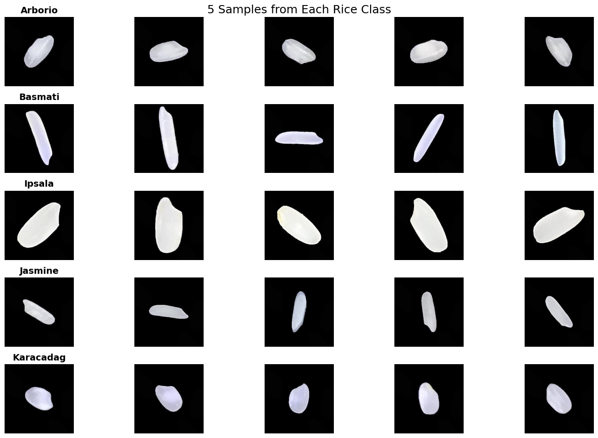
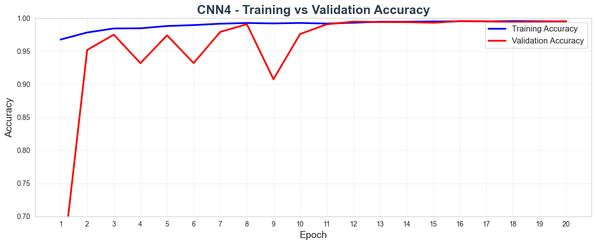
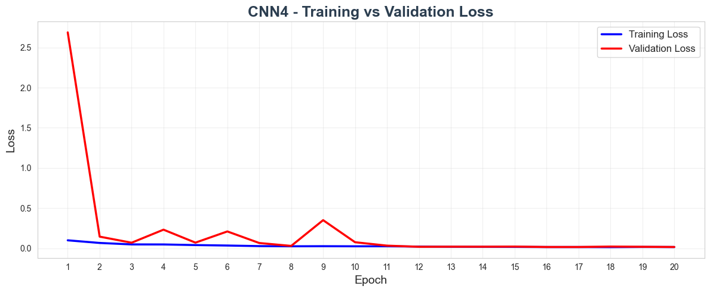
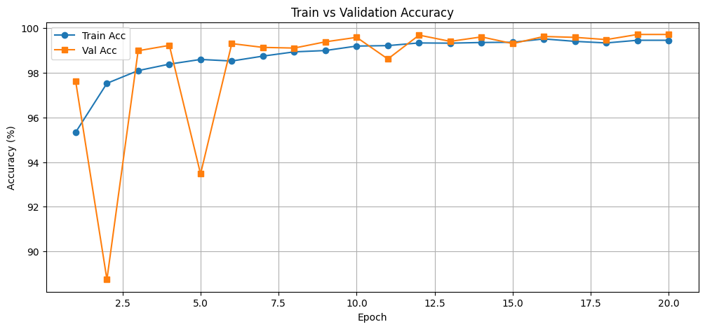
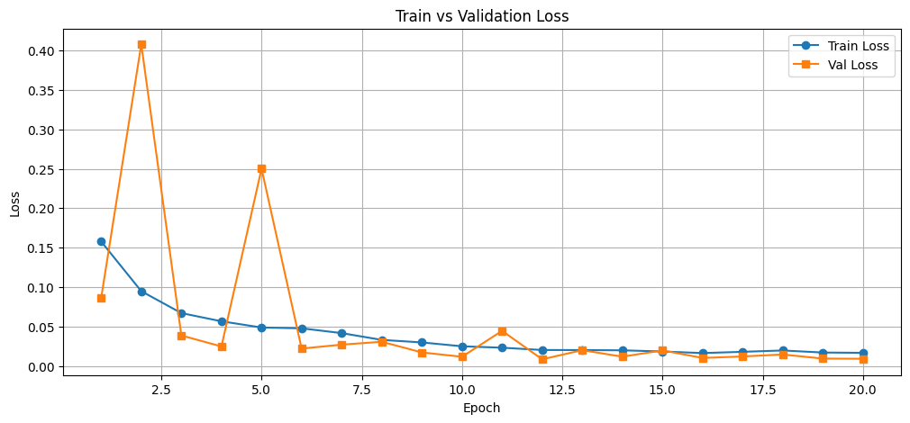

# Rice Type Classification with CNNs

Image classification of five rice varieties (Arborio, Basmati, Ipsala, Jasmine and Karacadag) with convolutional neural networks. The task is implemented twice, once in TensorFlow/Keras and once in PyTorch. Each notebook covers the full workflow: indexing and splitting the data, building the input pipeline, a documented series of experiments, and a final evaluation on held-out test images.

## Results at a glance

| Implementation | Final model | Parameters | Test images | Test accuracy | Test loss |
| --- | --- | ---: | ---: | ---: | ---: |
| TensorFlow-Keras | `CNN4`: one convolutional block, BatchNorm, Dropout, data augmentation | 8.39 M | 7,500 | 99.45% | 0.0178 |
| PyTorch | `SimpleCNN`: one convolutional layer, BatchNorm, Dropout | 82.4 K | 15,000 | 99.46% | 0.0178 |

## Contents

- [Highlights](#highlights)
- [Dataset](#dataset)
- [Repository structure](#repository-structure)
- [TensorFlow-Keras implementation](#tensorflow-keras-implementation)
- [PyTorch implementation](#pytorch-implementation)
- [Getting started](#getting-started)

## Highlights

- Two independent implementations of the same task: TensorFlow/Keras with a `tf.data` input pipeline, `Sequential` models and training callbacks, and PyTorch with a custom `Dataset`, `DataLoader`s and hand-written training and evaluation loops.
- Regularization and training-stability techniques applied and compared: Batch Normalization, Dropout, data augmentation, learning-rate reduction on plateau and early stopping.
- A clean evaluation protocol: models are chosen on the validation set, and the test set is used only for the final evaluation.
- Evaluation beyond accuracy: per-class precision, recall and F1-score, a confusion matrix, and correct and misclassified counts for every split.
- Compact models: the final PyTorch network has 82,405 parameters and classifies 99.46% of its 15,000 test images correctly.

## Dataset

The [Rice Image Dataset](https://www.kaggle.com/datasets/muratkokludataset/rice-image-dataset) (Koklu et al., 2021) contains 75,000 JPEG images of five rice varieties, with 15,000 images per variety. Each 250 × 250 pixel image shows a single grain on a black background. Both notebooks resize the images to 128 × 128 pixels.

The dataset is not included in this repository. See [Getting started](#getting-started) for download instructions.



## Repository structure

```text
Rice-Type-Classification-CNN/
├── TensorFlow-Keras/
│   ├── Rice-Type-Classification-TensorFlow.ipynb   # Keras pipeline, 8 experiments, final evaluation
│   └── dataset-link.txt                            # Kaggle dataset URL
├── PyTorch/
│   ├── Rice-Type-Classification-PyTorch.ipynb      # PyTorch pipeline, 3 experiments, final evaluation
│   └── dataset-link.txt                            # Kaggle dataset URL
├── assets/                                         # Figures used in this README
├── model9-SEED42_history.pkl                       # Per-epoch training history of the final Keras model
├── .gitignore
└── README.md
```

Trained model files are not included; the notebooks create them when run. The Keras notebook saves models (`.keras`) and training histories (`.pkl`) to `TensorFlow-Keras/working/`, and the PyTorch notebook saves the final model as `rice_cnn_model.pth` in its working directory.

## TensorFlow-Keras implementation

Notebook: [`TensorFlow-Keras/Rice-Type-Classification-TensorFlow.ipynb`](TensorFlow-Keras/Rice-Type-Classification-TensorFlow.ipynb)

### Data pipeline

- Image paths and labels are indexed in a pandas DataFrame (75,000 rows, no missing values).
- `train_test_split` with `random_state=42` holds out 10% of the images for testing and 30% of the remainder for validation: 47,250 training, 20,250 validation and 7,500 test images (63% / 27% / 10%). The split is not stratified, but the classes stay close to balanced (9,420 to 9,499 training images per class).
- Class names are sorted alphabetically (Arborio = 0 to Karacadag = 4) and the labels are one-hot encoded.
- A `tf.data` pipeline shuffles the file paths, then reads, decodes and resizes each image to 128 × 128, scales pixel values to [0, 1], and batches (32) and prefetches in parallel. Shuffling paths rather than decoded images keeps the shuffle buffer small: the decoded training set would occupy about 9 GB as float32.

### Experiments

Each run responds to what the previous one showed. Validation accuracy is given for the best and the last epoch.

| Run | Model | What changed | Epochs | Val. accuracy (best / last) | Observation |
| ---: | --- | --- | ---: | --- | --- |
| 1 | `CNN` | Baseline: Conv2D(32) → MaxPool → Dense(256) → Dense(5, sigmoid) | 10 | 98.77% / 97.00% | Validation loss rose from 0.044 (epoch 4) to 0.129: overfitting |
| 2 | `CNN1` | Softmax output; validation share raised to 45% | 10 | 98.52% / 98.52% | Large gap between training and validation loss (0.007 vs. 0.078) |
| 3 | `CNN3` | Deeper: two blocks of 2 × Conv2D + BatchNorm, Dropout, Adam at 3e-4 | 10 | 99.10% / 96.29% | About 3× slower per epoch; validation accuracy unstable (49.82% after epoch 1) |
| 4 | `CNN4` | Lighter: one Conv2D + BatchNorm, two MaxPool layers, Dropout; augmentation, early stopping, learning-rate reduction | 17 | 99.47% / 99.36% | Stable after the first learning-rate reduction; selected design |
| 5 | `CNN5` | Run 4 without augmentation or callbacks | 20 | 99.26% / 99.22% | Validation accuracy fell as low as 74.24% (epoch 8) |
| 6 | `CNN6` | Third MaxPool layer, Adam at 3e-4, no augmentation or callbacks | 18 | 99.70% / 98.92% | Sharp drops to 92.62% and 95.22% at epochs 9 and 10 |
| 7 | `CNN7` | No BatchNorm or Dropout, no augmentation or callbacks | 20 | 99.28% / 99.08% | 99.97% training accuracy while validation loss rose from 0.024 to 0.062 |
| 8 | `CNN4` | Run 4's setup retrained for 20 epochs with seed 42 and deterministic operations | 20 | 99.56% / 99.53% | Final model |

Run 2 splits the non-test data 55/45 into training and validation; all other runs use the 70/30 split described above. Runs 4 and 5 share the same architecture, so together they isolate the effect of data augmentation and learning-rate scheduling on training stability.

### Final model

| Layer | Output shape | Parameters |
| --- | --- | ---: |
| Input | 128 × 128 × 3 | 0 |
| Conv2D, 32 filters, 3 × 3, same padding, ReLU | 128 × 128 × 32 | 896 |
| BatchNormalization | 128 × 128 × 32 | 128 |
| MaxPooling2D, 2 × 2 | 64 × 64 × 32 | 0 |
| MaxPooling2D, 2 × 2 | 32 × 32 × 32 | 0 |
| Dropout, 0.3 | 32 × 32 × 32 | 0 |
| Flatten | 32,768 | 0 |
| Dense, 256 units, ReLU | 256 | 8,388,864 |
| BatchNormalization | 256 | 1,024 |
| Dropout, 0.5 | 256 | 0 |
| Dense, 5 units, softmax | 5 | 1,285 |
| Total | | 8,392,197 (8,391,621 trainable) |

| Setting | Value |
| --- | --- |
| Loss | Categorical cross-entropy |
| Optimizer | Adam, initial learning rate 1e-3 |
| Batch size | 32 |
| Epochs | 20 (early stopping was configured but did not trigger) |
| Learning-rate schedule | `ReduceLROnPlateau` on validation loss (factor 0.5, patience 3, minimum 1e-5): 1e-3, then 5e-4 from epoch 7, 2.5e-4 from epoch 12 and 1.25e-4 from epoch 16 |
| Early stopping | `EarlyStopping` on validation loss, patience 5, restore best weights |
| Augmentation (training only) | Random horizontal flip, brightness (max delta 0.1), contrast and saturation (factor 0.9 to 1.1) |
| Seed | 42 for Python, NumPy and TensorFlow, with `tf.config.experimental.enable_op_determinism()` |

### Results

On the 7,500 test images the final model reaches 99.45% accuracy (7,459 correct, 41 misclassified), a loss of 0.0178 and a macro-averaged F1-score of 0.9945.

| Class | Precision | Recall | F1-score | Test images |
| --- | ---: | ---: | ---: | ---: |
| Arborio | 0.9934 | 0.9882 | 0.9908 | 1,522 |
| Basmati | 0.9948 | 0.9974 | 0.9961 | 1,537 |
| Ipsala | 1.0000 | 0.9993 | 0.9997 | 1,522 |
| Jasmine | 0.9966 | 0.9924 | 0.9945 | 1,456 |
| Karacadag | 0.9878 | 0.9952 | 0.9915 | 1,463 |
| Macro average | 0.9945 | 0.9945 | 0.9945 | 7,500 |

Confusion matrix on the test set (rows are true classes, columns are predictions):

| True class | Arborio | Basmati | Ipsala | Jasmine | Karacadag |
| --- | ---: | ---: | ---: | ---: | ---: |
| Arborio | 1,504 | 0 | 0 | 1 | 17 |
| Basmati | 0 | 1,533 | 0 | 4 | 0 |
| Ipsala | 1 | 0 | 1,521 | 0 | 0 |
| Jasmine | 2 | 8 | 0 | 1,445 | 1 |
| Karacadag | 7 | 0 | 0 | 0 | 1,456 |

36 of the 41 errors are confusions between varieties with similar grain shapes: 24 between the short, rounded Arborio and Karacadag grains (17 Arborio predicted as Karacadag, 7 the other way), and 12 between the long, slender Basmati and Jasmine grains (8 Jasmine predicted as Basmati, 4 the other way). Ipsala is misclassified once, and no other grain is ever predicted as Ipsala.





Validation accuracy fluctuates during the first 11 epochs and stays between 99.30% and 99.56% from epoch 12 onward, once the learning rate has been halved twice. The accuracy plot starts at 0.70 on the y-axis, so the first epoch (59.97% validation accuracy) falls below the visible range.

## PyTorch implementation

Notebook: [`PyTorch/Rice-Type-Classification-PyTorch.ipynb`](PyTorch/Rice-Type-Classification-PyTorch.ipynb)

### Data pipeline

- Image paths and labels are indexed in a pandas DataFrame, with labels encoded by `pd.factorize`.
- A stratified split with `random_state=42` holds out 20% of the images for testing and 12.5% of the remainder for validation: 52,500 training, 7,500 validation and 15,000 test images (70% / 10% / 20%), with equal class counts in every split.
- A custom `RiceDataset` (`torch.utils.data.Dataset`) opens each image with Pillow and applies `Resize((128, 128))`, `ToTensor()` and `Normalize(mean=0.5, std=0.5)` per channel, which maps pixel values to [-1, 1].
- `DataLoader`s use a batch size of 32; only the training loader shuffles.

### Experiments

| Run | Model | Architecture | Parameters | Epochs | Observation |
| ---: | --- | --- | ---: | ---: | --- |
| 1 | `TinyCNN` | Conv2d(3→8) → ReLU → MaxPool → Linear | 164,069 | 10 | Validation loss oscillated between 0.013 and 0.042 |
| 2 | `SimpleCNN` | Conv2d(3→16) → BatchNorm → ReLU → 2 × MaxPool → Dropout(0.3) → Linear | 82,405 | 10 | Reached 99.60% validation accuracy at epoch 7, then dropped to 98.47% at epoch 9 |
| 3 | `SimpleCNN` | Same model, retrained from scratch for longer | 82,405 | 20 | Stable from epoch 12 (99.31% to 99.72%); final model |

All runs use Adam (learning rate 1e-3) and cross-entropy loss, without augmentation or a learning-rate schedule. The model is evaluated as it stands after the last epoch.

### Final model

| Layer | Output shape | Parameters |
| --- | --- | ---: |
| Input | 3 × 128 × 128 | 0 |
| Conv2d, 16 filters, 3 × 3, padding 1 | 16 × 128 × 128 | 448 |
| BatchNorm2d, ReLU | 16 × 128 × 128 | 32 |
| MaxPool2d, 2 × 2 | 16 × 64 × 64 | 0 |
| MaxPool2d, 2 × 2 | 16 × 32 × 32 | 0 |
| Flatten, Dropout 0.3 | 16,384 | 0 |
| Linear | 5 | 81,925 |
| Total | | 82,405 |

### Results

After 20 epochs, evaluated in inference mode on every split:

| Split | Images | Correct | Misclassified | Accuracy | Loss |
| --- | ---: | ---: | ---: | ---: | ---: |
| Train | 52,500 | 52,388 | 112 | 99.79% | 0.0069 |
| Validation | 7,500 | 7,479 | 21 | 99.72% | 0.0091 |
| Test | 15,000 | 14,919 | 81 | 99.46% | 0.0178 |

Training and test accuracy differ by only 0.33 percentage points.





Validation accuracy drops at epochs 2 (88.74%) and 5 (93.47%) and stays between 99.31% and 99.72% from epoch 12 onward.

## Getting started

### Requirements

The two notebooks are independent, so you only need the stack for the one you want to run. These are the versions they were run with:

| Notebook | Environment |
| --- | --- |
| TensorFlow-Keras | Python 3.10.11, TensorFlow 2.10.1 (Keras 2.10.0), NumPy 1.23.5, run locally on Windows |
| PyTorch | Python 3.11, PyTorch 2.6.0, torchvision 0.21.0, run on Kaggle |

Both notebooks also use pandas, Matplotlib, seaborn, scikit-learn and Pillow.

```bash
python -m venv .venv
source .venv/bin/activate        # on Windows: .venv\Scripts\activate

# TensorFlow-Keras notebook (TensorFlow 2.10 supports Python 3.7 to 3.10)
pip install tensorflow==2.10.1 numpy==1.23.5 pandas matplotlib seaborn scikit-learn pillow jupyter

# PyTorch notebook
pip install torch torchvision pandas matplotlib seaborn scikit-learn pillow jupyter
```

The first cell of each notebook installs its framework with `pip`; you can skip it once the environment is set up.

### Dataset

Download the dataset from [Kaggle](https://www.kaggle.com/datasets/muratkokludataset/rice-image-dataset), either through the website or with the [Kaggle CLI](https://github.com/Kaggle/kaggle-api) (requires a Kaggle API token):

```bash
kaggle datasets download muratkokludataset/rice-image-dataset -p TensorFlow-Keras --unzip
```

- **TensorFlow-Keras**: the notebook reads `Rice_Image_Dataset/` relative to its own folder:

  ```text
  TensorFlow-Keras/
  └── Rice_Image_Dataset/
      ├── Arborio/
      ├── Basmati/
      ├── Ipsala/
      ├── Jasmine/
      └── Karacadag/
  ```

- **PyTorch**: `dataset_path` points to `/kaggle/input/rice-image-dataset/Rice_Image_Dataset`, which works as-is on Kaggle once the dataset is added to the notebook. To run it locally, set `dataset_path` to your copy of `Rice_Image_Dataset/`.

### Using the trained Keras model

Run from the `TensorFlow-Keras/` folder, with the same TensorFlow version used for training (2.10.1):

```python
import numpy as np
import tensorflow as tf

CLASSES = ["Arborio", "Basmati", "Ipsala", "Jasmine", "Karacadag"]  # label order used in training

model = tf.keras.models.load_model("working/model9-SEED42.keras")

def predict(image_path):
    image = tf.io.read_file(image_path)
    image = tf.image.decode_jpeg(image, channels=3)
    image = tf.image.resize(image, (128, 128)) / 255.0  # same preprocessing as training
    probs = model.predict(image[tf.newaxis, ...], verbose=0)[0]
    return CLASSES[int(np.argmax(probs))], float(np.max(probs))

print(predict("Rice_Image_Dataset/Arborio/Arborio (1).jpg"))
```

### Inspecting the training history

`model9-SEED42_history.pkl` stores the per-epoch metrics of the final Keras run as plain Python lists, so only the standard library is needed to read it:

```python
import pickle

with open("model9-SEED42_history.pkl", "rb") as f:
    history = pickle.load(f)  # keys: loss, accuracy, val_loss, val_accuracy, lr

val_acc = history["val_accuracy"]
best = max(range(len(val_acc)), key=val_acc.__getitem__)
print(f"Best validation accuracy: {val_acc[best]:.4f} at epoch {best + 1}")
```
